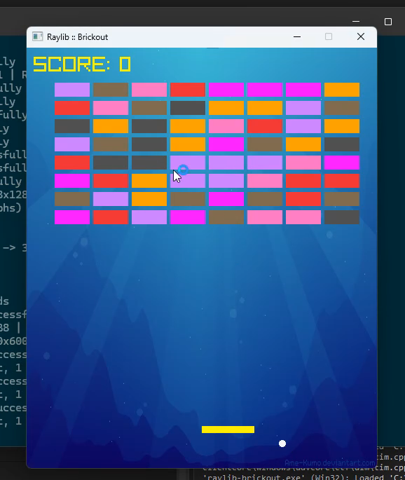

# Brickout Clone in C/C++ using Raylib

## 🔗Links & References:
- Raylib website: https://www.raylib.com/
- Raylib github: https://github.com/raysan5/raylib
- Raylib API Cheatsheet: https://www.raylib.com/cheatsheet/cheatsheet.html
- Pixel Ocean Background: https://www.reddit.com/r/PixelArt/comments/gly4k0/500x500_pixel_ocean_background_feel_free_to_use/
- JSFXR: https://sfxr.me/

## 👋🏻Connect with me:
Twitter: https://twitter.com/eyuzwa

## Developer Notes

- `git clone git@github.com:erikyuzwa/raylib-brickout-clone.git`
- `cd raylib-brickout-clone`
- Open the project with Visual Studio 2022

## License

Copyright 2023 Erik Yuzwa

Permission is hereby granted, free of charge, to any person obtaining a copy of this software and associated documentation
files (the “Software”), to deal in the Software without restriction, including without limitation the rights to use, copy,
modify, merge, publish, distribute, sublicense, and/or sell copies of the Software, and to permit persons to whom the
Software is furnished to do so, subject to the following conditions:

The above copyright notice and this permission notice shall be included in all copies or substantial portions of the
Software.

THE SOFTWARE IS PROVIDED “AS IS”, WITHOUT WARRANTY OF ANY KIND, EXPRESS OR IMPLIED, INCLUDING BUT NOT LIMITED TO THE
WARRANTIES OF MERCHANTABILITY, FITNESS FOR A PARTICULAR PURPOSE AND NONINFRINGEMENT. IN NO EVENT SHALL THE AUTHORS OR
COPYRIGHT HOLDERS BE LIABLE FOR ANY CLAIM, DAMAGES OR OTHER LIABILITY, WHETHER IN AN ACTION OF CONTRACT, TORT OR OTHERWISE,
ARISING FROM, OUT OF OR IN CONNECTION WITH THE SOFTWARE OR THE USE OR OTHER DEALINGS IN THE SOFTWARE.
